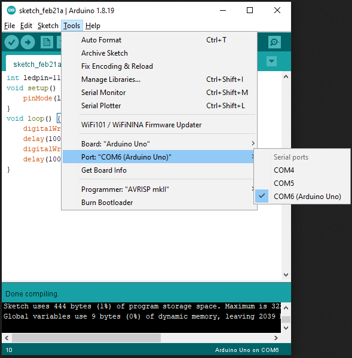

# Blinking an LED

??? abstract "Slides"
    <div class="reveal deck1">
      <div class="slides">
        <section data-markdown>
          <textarea data-template>
            # Arduino IDE
          	---
            ## Arduino IDE
            <svg viewBox="0 0 486 593" style="height:500px">
            	<image href="../img/arduinoide.png"/>
            	<!-- <rect x="5" y="85" width="476" height="350" stroke-width="5" stroke="red" fill-opacity="0"/> -->
            </svg>
          	---
            ## Arduino IDE
            <svg viewBox="0 0 486 593" style="height:500px">
            	<image href="../img/arduinoide.png"/>
            	<rect x="5" y="85" width="476" height="350" stroke-width="5" stroke="red" fill-opacity="0"/>
            </svg>
            ---
            <svg style="width:600px;height:600px">
            	<text x="300" y="100" text-anchor="middle" dominant-baseline="middle" style="fill:var(--r-main-color)">Robot booted</text>
            	<text x="300" y="300" text-anchor="middle" dominant-baseline="middle" style="fill:var(--r-main-color)">setup()</text>
            	<text x="300" y="500" text-anchor="middle" dominant-baseline="middle" style="fill:var(--r-main-color)">loop()</text>
            	<path d="M 300,150 l 0,100 l -10,-20 c 0,0 10,15 20,0 l -10,20" style="stroke:var(--r-main-color);fill:var(--r-main-color)"/>
            	<path d="M 300,350 l 0,100 l -10,-20 c 0,0 10,15 20,0 l -10,20" style="stroke:var(--r-main-color);fill:var(--r-main-color)"/>
            	<path d="M 350,460 l 0,-20 100,0 0,120 -100,0 0,-40" style="stroke:var(--r-main-color);fill:none"/>
            	<path d="M 350,520 l -10,20 c 0,0 10,-15 20,0 l -10,-20" style="stroke:var(--r-main-color);fill:var(--r-main-color)"/>
          	</svg>
            ---
            ## LED on the robot
            { style="height:150px" }
            { style="height:150px" }
            ---
            
            LED is connected to pin 11 of the Arduino Uno
            ---
            ## Control LED
            ---
            Define a variable `ledpin` to be `11`
            ```c++ hl_lines="1"
            int ledpin=11;
            void setup() {
            }
            void loop() {
            }
            ```
            We will use this variable to refer to our LED afterwards
            ---
            Initialize the `ledpin` as output
            ```c++ hl_lines="3"
            int ledpin=11;
            void setup() {
              pinMode(ledpin, OUTPUT);
            }
            void loop() {
            }
            ```
            ---
            ## Turn LED on or off
            This is achieved with
            ```c++
            digitalWrite(ledpin, HIGH)
            ```
            or 
            ```c++
            digitalWrite(ledpin, LOW)
            ```
            ---
            ### `digitalWrite(ledpin, HIGH)`
            By sending the HIGH signal, we are giving the LED a high voltage level
            <br><br>for microcontroller this is typically 3.3V or 5V
            ---
            ### `digitalWrite(ledpin, LOW)`
            Similarly, sending the LOW signal, the LED is given a low voltage level, which is close or equal to 0V
            ---
            ## So let's try to make the LED blink.
            ---
            The blinking is done by light up the LED for some amount of time and then turn it off for some amount of time repeatedly.
            ---
            We will use a time delay command to achieve the time between LED on and LED off, as well as between LED off and LED on.
            ```c++
            delay(1000)
            ```
            ---
            ### `delay(1000)`
            The number in the parentheses (a.k.a. the round brackets) is the amount of time to be delayed in unit of milliseconds.
            <br><br>How long is this delay?
            ---
            Here is the code to achieve the blinking of LED
            ```c++ hl_lines="6-9"
            int ledpin=11;
            void setup() {
              pinMode(ledpin, OUTPUT);
            }
            void loop() {
              digitalWrite(ledpin, HIGH);
              delay(1000);
              digitalWrite(ledpin, LOW);
              delay(1000);
            }
            ```
            ---
            ## How do we upload the program to the robot?
            ---
            1. Connect the robot to the computer using the USB cable
            2. Make sure the Arduino IDE "see"s the robot
            3. Verify the code and upload to the robot using the Arduino IDE
            ---
            ### Connect the robot to the computer
            { style="height:150px" }
            { style="height:150px" } 
            ---
            <div style="display:flex;flex-direction:row;align-items:center">
            <svg viewBox="0 0 1500 843" style="height:200px">
       				<image href="https://res.cloudinary.com/rsc/image/upload/b_rgb:FFFFFF,c_pad,dpr_1.0,f_auto,h_843,q_auto,w_1500/c_pad,h_843,w_1500/F0411176-01?pgw=1&pgwact=1"/>
            	<rect x="300" y="500" width="420" height="330" stroke-width="20" stroke="red" fill-opacity="0"/>
            </svg>
            <svg viewBox="0 0 400 339" style="height:500px">
       				<image width="400" height="339" href="https://upload.wikimedia.org/wikipedia/commons/3/38/Arduino_Uno_-_R3.jpg"/>
            	<rect x="10" y="140" width="120" height="110" stroke-width="5" stroke="red" fill-opacity="0"/>
            </svg>
            </div>
            ---
            ### Make sure Arduino IDE sees the robot
            { style="height:500px" }
            ---
            ### Verify and upload
            <svg viewBox="0 0 486 593" style="height:500px">
            	<image href="../img/verifyandupload.png"/>
            	<rect x="2" y="50" width="30" height="35" stroke-width="5" stroke="red" fill-opacity="0"/>
            </svg>
            <br>
            Click to verify if the code has any error
            ---
            You will be asked to provide a file name to save the code, this is optional, but it's good to do so for your record.
            ---
            You can use the "verify" button even when you are not connected to a microcontroller to check your code.
            ---
            ### Verify and upload
            <svg viewBox="0 0 486 593" style="height:500px">
            	<image href="../img/verifyandupload.png"/>
            	<rect x="2" y="470" width="480" height="40" stroke-width="5" stroke="red" fill-opacity="0"/>
            </svg>
            <br>
            If no error, there will be "Done compiling"
            ---
            ### Verify and upload
            <svg viewBox="0 0 486 593" style="height:500px">
            	<image href="../img/verifyandupload.png"/>
            	<rect x="30" y="50" width="30" height="35" stroke-width="5" stroke="red" fill-opacity="0"/>
            </svg>
            <br>
            Click to upload the code to Arduino Uno
            ---
            ### Verify and upload
            <svg viewBox="0 0 486 593" style="height:500px">
            	<image href="../img/doneupload.png"/>
            	<rect x="2" y="470" width="480" height="40" stroke-width="5" stroke="red" fill-opacity="0"/>
            </svg>
            <br>
            If no error, there will be "Done uploading"
            ---
            After the code is uploaded, you should see the LED blinking at a rate of 1 second of light on and 1 second of light off.
            ---
            How do we make the LED blinking at a faster or slower speed?
            ---
            Can we blink the LED with the following pattern?
            <br>
            3 sec on &rarr; 1 sec off &rarr; 2 sec on &rarr; 0.5 sec off &rarr; repeat
          </textarea>
        </section>
      </div>
    </div>
    !!! info inline end ""
        <kbd>F</kbd> for fullscreen &middot;
        <kbd>O</kbd> for overview

## Arduino IDE

<figure>
	<div style="display:flex;flex-direction:row">
		
		<svg viewBox="200 0 200 400" style="height:400px">
			<text x="300" y="100" text-anchor="middle" dominant-baseline="middle" style="fill:var(--r-main-color)">Robot booted</text>
			<text x="300" y="200" text-anchor="middle" dominant-baseline="middle" style="fill:var(--r-main-color)">setup()</text>
			<text x="300" y="300" text-anchor="middle" dominant-baseline="middle" style="fill:var(--r-main-color)">loop()</text>
			<path d="M 300,120 l 0,60 l -10,-20 c 0,0 10,15 20,0 l -10,20" style="stroke:var(--r-main-color);fill:var(--r-main-color)"/>
			<path d="M 300,220 l 0,60 l -10,-20 c 0,0 10,15 20,0 l -10,20" style="stroke:var(--r-main-color);fill:var(--r-main-color)"/>
			<path d="M 320,280 l 0,-10 60,0 0,60 -60,0 0,-20" style="stroke:var(--r-main-color);fill:none"/>
			<path d="M 320,310 l -10,20 c 0,0 10,-15 20,0 l -10,-20" style="stroke:var(--r-main-color);fill:var(--r-main-color)"/>
		</svg>
	</div>
<figcaption>Arduino IDE and program flowchart</figcaption>
</figure>

## LED on the robot
<figure>
	<div style="display:flex;flex-direction:row">
		
		
	</div>
<figcaption>LED Module</figcaption>
</figure>

<figure markdown>
{ style="height:150px" }
<figcaption>LED is connected to pin 11 of the Arduino Uno</figcaption>
</figure>


## Make LED blink

```c++ linenums="1"
int ledpin=11;                 //(1)
void setup() {
  pinMode(ledpin, OUTPUT);     //(2)
}
void loop() {
  digitalWrite(ledpin, HIGH);  //(3)
  delay(1000);                 //(5)
  digitalWrite(ledpin, LOW);   //(4)
  delay(1000);
}
```

1. Define a variable `ledpin` to be `11`
2. Initialize the `ledpin` as output
3. By sending the HIGH signal, we are giving the LED a high voltage level. Typically for microcontroller, this is 3.3V or 5V.
4. The LOW signal gives the LED a low voltage level, which is close or equal to 0V.
5. Time delay between two commands. The time is defined with the unit of milliseconds.

## Verify and upload the program to the Arduino Uno (the microcontroller of the robot)

### Connecting the robot to the computer
<figure>
  <div style="display:flex;flex-direction:row;align-items:center">
    <svg viewBox="0 0 1500 843" style="height:150px">
      <image href="https://res.cloudinary.com/rsc/image/upload/b_rgb:FFFFFF,c_pad,dpr_1.0,f_auto,h_843,q_auto,w_1500/c_pad,h_843,w_1500/F0411176-01?pgw=1&pgwact=1"/>
      <rect x="300" y="500" width="420" height="330" stroke-width="20" stroke="red" fill-opacity="0"/>
    </svg>
    <svg viewBox="0 0 400 339" style="height:400px">
      <image width="400" height="339" href="https://upload.wikimedia.org/wikipedia/commons/3/38/Arduino_Uno_-_R3.jpg"/>
      <rect x="10" y="140" width="120" height="110" stroke-width="5" stroke="red" fill-opacity="0"/>
    </svg>
  </div>
  <figcaption>Connect to the USB-B port of the robot</figcaption>
</figure>

### Verify COM port
<figure markdown>
{ style="height:500px" }
<figcaption>Check if the Arduino IDE detects the Arduino Uno port</figcaption>
</figure>

### Verify and upload the program
<figure>
  <svg viewBox="0 0 486 593" style="height:500px">
    <image href="../img/verifyandupload.png"/>
    <rect x="2" y="50" width="30" height="35" stroke-width="5" stroke="red" fill-opacity="0"/>
  </svg>
  <figcaption>Click to verify if the code has any error</figcaption>
</figure>

!!! info ""
    You can use the "verify" button even when you are not connected to a microcontroller to check your code.

<figure>
  <svg viewBox="0 0 486 593" style="height:500px">
    <image href="../img/verifyandupload.png"/>
    <rect x="2" y="470" width="480" height="40" stroke-width="5" stroke="red" fill-opacity="0"/>
  </svg>
  <figcaption>If no error, there will be "Done compiling"</figcaption>
</figure>


<figure>
  <svg viewBox="0 0 486 593" style="height:500px">
    <image href="../img/verifyandupload.png"/>
    <rect x="30" y="50" width="30" height="35" stroke-width="5" stroke="red" fill-opacity="0"/>
  </svg>
  <figcaption>Click to upload the code to Arduino Uno</figcaption>
</figure>

<figure>
  <svg viewBox="0 0 486 593" style="height:500px">
    <image href="../img/doneupload.png"/>
    <rect x="2" y="470" width="480" height="40" stroke-width="5" stroke="red" fill-opacity="0"/>
  </svg>
  <figcaption>If no error, there will be "Done uploading"</figcaption>
</figure>

After the code is uploaded, you should see the LED blinking at a rate of 1 second of light on and 1 second of light off.

## Bring it further

1. How do we make the LED blinking at a faster or slower speed?
2. Can we blink the LED with the following pattern?
    
    3 sec on &rarr; 1 sec off &rarr; 2 sec on &rarr; 0.5 sec off &rarr; repeat