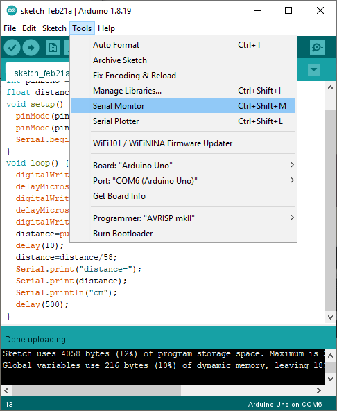
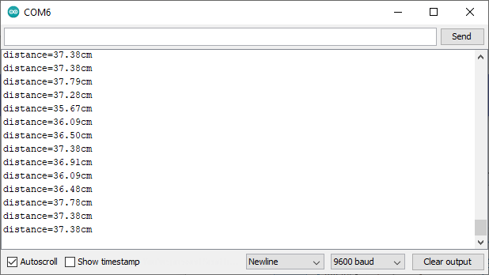

# Ultrasonic sensor

??? abstract "Slides"
    <div class="reveal deck1">
      <div class="slides">
        <section data-markdown>
          <textarea data-template>
            # Ultrasonic sensor
            { style="height:200px" }
            ---
            ## Principle of ultrasonic sensor (echo)
            { style="height:300px" }
            ---
            ## Connection of ultrasonic sensor to the board
            { style="height:300px" }
            ---
            { style="height:300px" }
            <div style="display:flex;flex-direction:row">
              <div style="flex-grow:1">
                <table>
                  <tr>
                    <th style="text-align: left;">Purpose</th>
                    <th style="text-align: center;">Mode</th>
                    <th style="text-align: center;">Pin on board</th>
                  </tr>
                  <tr>
                    <td style="text-align: left;">Emit sound (Trip)</td>
                    <td style="text-align: center;">Output</td>
                    <td style="text-align: center;">12</td>
                  </tr>
                  <tr>
                    <td style="text-align: left;">Receive sound (Echo)</td>
                    <td style="text-align: center;">Input</td>
                    <td style="text-align: center;">13</td>
                  </tr>
                </table>
              </div>
              <div style="flex-grow:1;display:flex;flex-direction:column;align-items:stretch;justify-content:center;">
                ```c++
                int pinTrip = 12;
                int pinEcho = 13;
                void setup() {
                  pinMode(pinTrip, OUTPUT);
                  pinMode(pinEcho, INPUT);
                }
                ```
              </div>
            </div>
            ---
            ## Distance calculation 
            Distance of the object in front of the ultrasonic sensor can be calculated using the time between sending and receiving the signal (sound)
            ---
            <svg viewBox="0 0 493 269" style="height:400px">
              <image href="https://wiki.keyestudio.com/images/4/4c/KS0313_3-2-1.png"/>
              <path d="M 350,200 l -250,0" style="fill:none;stroke:black;stroke-width:3px" />
              <path d="M 100,200 l 15,-5 c 0,0 -5,5 0,10 l -15,-5 z" style="fill:black;stroke:black;stroke-width:3px" />
              <path d="M 100,225 l 250,0" style="fill:none;stroke:black;stroke-width:3px" />
              <path d="M 350,225 l -15,-5 c 0,0 5,5 0,10 l 15,-5 z" style="fill:black;stroke:black;stroke-width:3px" />
              <path d="M 350,25 l -250,0" style="fill:none;stroke:var(--r-main-color);stroke-width:3px" />
              <path d="M 100,25 l 15,-5 c 0,0 -5,5 0,10 l -15,-5 z" style="fill:var(--r-main-color);stroke:var(--r-main-color);stroke-width:3px" />
              <path d="M 350,25 l -15,-5 c 0,0 5,5 0,10 l 15,-5 z" style="fill:var(--r-main-color);stroke:var(--r-main-color);stroke-width:3px" />
              <text x="225" y="30" dominant-baseline="hanging" text-anchor="middle" style="font-size:20px">d</text>
            </svg>
            Time between sending and receiving
            <br>= time to travel for $2d$ = $T$ &micro;s
            ---
            ### Formula derivation
            <p></p>
            \\[\begin{aligned}
            \text{distance }d &amp; = \frac{T \text{ &micro;s}\times \text{speed of sound}}{2}\\\\
            &amp; = \frac{T \text{ &micro;s} \times 340 \text{ m/s}}{2}\\\\
            &amp; = T \times 10^{-6} \text{ s} \times 170 \times 10^2 \text{ cm/s}\\\\
            &amp; = 170 \times 10^{-4} \times T \text{ cm}\\\\
            &amp; \approx \frac{T}{58} \text{ cm}
            \end{aligned}\\]
            ---
            To implement the emission and recipient of sound and calculating the distance of the object in code,
            <div style="display:flex;flex-direction:row">
              <div style="flex-grow:1">
                <svg viewBox="-200 0 400 600" style="height:500px">
                  <style>.block { fill: var(--r-main-color); } .line { fill: var(--r-main-color); stroke: var(--r-main-color); }</style>
                  <text x="0" y="100" text-anchor="middle" dominant-baseline="middle" class="block">Emit (>10&micro;s)</text>
                  <text x="0" y="300" text-anchor="middle" dominant-baseline="middle" class="block">Receive</text>
                  <text x="0" y="500" text-anchor="middle" dominant-baseline="middle" class="block">Calculate distance</text>
                  <path d="M 0,150 l 0,100 l -10,-20 c 0,0 10,15 20,0 l -10,20" class="line"/>
                  <path d="M 0,350 l 0,100 l -10,-20 c 0,0 10,15 20,0 l -10,20"  class="line"/>
                </svg>
              </div>
              <div style="flex-grow:1;display:flex;flex-direction:column;align-items:stretch;justify-content:center;">
                ```c++
                void loop() {
                  digitalWrite(pinTrip,LOW);
                  delayMicroseconds(2);
                  digitalWrite(pinTrip,HIGH);
                  delayMicroseconds(12);
                  digitalWrite(pinTrip,LOW);
                  distance=pulseIn(pinEcho,HIGH);
                  delay(10);
                  distance=distance/58;
                  delay(500);
                }
                ```
              </div>
            </div>
            ---
            To implement the emission and recipient of sound and calculating the distance of the object in code,
            <div style="display:flex;flex-direction:row">
              <div style="flex-grow:1">
                <svg viewBox="-200 0 400 600" style="height:500px">
                  <style>.block { fill: var(--r-main-color); } .line { fill: var(--r-main-color); stroke: var(--r-main-color); }</style>
                  <rect x="-200" y="50" width="400" height="100" fill="yellow"/>
                  <text x="0" y="100" text-anchor="middle" dominant-baseline="middle" class="block">Emit (>10&micro;s)</text>
                  <text x="0" y="300" text-anchor="middle" dominant-baseline="middle" class="block">Receive</text>
                  <text x="0" y="500" text-anchor="middle" dominant-baseline="middle" class="block">Calculate distance</text>
                  <path d="M 0,150 l 0,100 l -10,-20 c 0,0 10,15 20,0 l -10,20" class="line"/>
                  <path d="M 0,350 l 0,100 l -10,-20 c 0,0 10,15 20,0 l -10,20"  class="line"/>
                </svg>
              </div>
              <div style="flex-grow:1;display:flex;flex-direction:column;align-items:stretch;justify-content:center;">
                ```c++ hl_lines="2-5"
                void loop() {
                  digitalWrite(pinTrip,LOW);
                  delayMicroseconds(2);
                  digitalWrite(pinTrip,HIGH);
                  delayMicroseconds(12);
                  digitalWrite(pinTrip,LOW);
                  distance=pulseIn(pinEcho,HIGH);
                  delay(10);
                  distance=distance/58;
                  delay(500);
                }
                ```
              </div>
            </div>
            ---
            To implement the emission and recipient of sound and calculating the distance of the object in code,
            <div style="display:flex;flex-direction:row">
              <div style="flex-grow:1">
                <svg viewBox="-200 0 400 600" style="height:500px">
                  <style>.block { fill: var(--r-main-color); } .line { fill: var(--r-main-color); stroke: var(--r-main-color); }</style>
                  <rect x="-200" y="250" width="400" height="100" fill="yellow"/>
                  <text x="0" y="100" text-anchor="middle" dominant-baseline="middle" class="block">Emit (>10&micro;s)</text>
                  <text x="0" y="300" text-anchor="middle" dominant-baseline="middle" class="block">Receive</text>
                  <text x="0" y="500" text-anchor="middle" dominant-baseline="middle" class="block">Calculate distance</text>
                  <path d="M 0,150 l 0,100 l -10,-20 c 0,0 10,15 20,0 l -10,20" class="line"/>
                  <path d="M 0,350 l 0,100 l -10,-20 c 0,0 10,15 20,0 l -10,20"  class="line"/>
                </svg>
              </div>
              <div style="flex-grow:1;display:flex;flex-direction:column;align-items:stretch;justify-content:center;">
                ```c++ hl_lines="6-8"
                void loop() {
                  digitalWrite(pinTrip,LOW);
                  delayMicroseconds(2);
                  digitalWrite(pinTrip,HIGH);
                  delayMicroseconds(12);
                  digitalWrite(pinTrip,LOW);
                  distance=pulseIn(pinEcho,HIGH);
                  delay(10);
                  distance=distance/58;
                  delay(500);
                }
                ```
              </div>
            </div>
            ---
            To implement the emission and recipient of sound and calculating the distance of the object in code,
            <div style="display:flex;flex-direction:row">
              <div style="flex-grow:1">
                <svg viewBox="-200 0 400 600" style="height:500px">
                  <style>.block { fill: var(--r-main-color); } .line { fill: var(--r-main-color); stroke: var(--r-main-color); }</style>
                  <rect x="-200" y="450" width="400" height="100" fill="yellow"/>
                  <text x="0" y="100" text-anchor="middle" dominant-baseline="middle" class="block">Emit (>10&micro;s)</text>
                  <text x="0" y="300" text-anchor="middle" dominant-baseline="middle" class="block">Receive</text>
                  <text x="0" y="500" text-anchor="middle" dominant-baseline="middle" class="block">Calculate distance</text>
                  <path d="M 0,150 l 0,100 l -10,-20 c 0,0 10,15 20,0 l -10,20" class="line"/>
                  <path d="M 0,350 l 0,100 l -10,-20 c 0,0 10,15 20,0 l -10,20"  class="line"/>
                </svg>
              </div>
              <div style="flex-grow:1;display:flex;flex-direction:column;align-items:stretch;justify-content:center;">
                ```c++ hl_lines="9-10"
                void loop() {
                  digitalWrite(pinTrip,LOW);
                  delayMicroseconds(2);
                  digitalWrite(pinTrip,HIGH);
                  delayMicroseconds(12);
                  digitalWrite(pinTrip,LOW);
                  distance=pulseIn(pinEcho,HIGH);
                  delay(10);
                  distance=distance/58;
                  delay(500);
                }
                ```
              </div>
            </div>
            ---
            We can use the serial monitor to display the reading of ultrasonic and the distance calculated
            <div style="display:flex;flex-direction:row">
              <div style="flex-grow:1">
                <svg viewBox="-200 0 400 400" style="height:300px">
                  <style>.block { fill: var(--r-main-color); } .line { fill: var(--r-main-color); stroke: var(--r-main-color); }</style>
                  <text x="0" y="100" text-anchor="middle" dominant-baseline="middle" class="block">Enable</text>
                  <text x="0" y="300" text-anchor="middle" dominant-baseline="middle" class="block">Display</text>
                  <path d="M 0,150 l 0,100 l -10,-20 c 0,0 10,15 20,0 l -10,20" class="line"/>
                </svg>
              </div>
              <div style="flex-grow:1;display:flex;flex-direction:column;align-items:stretch;justify-content:center;">
                ```c++
                ...
                void setup() {
                  ...
                  Serial.begin(9600);
                }
                void loop() {
                  ...
                  distance=distance/58;
                  Serial.print("distance=");
                  Serial.print(distance);
                  Serial.println("cm");
                  delay(500);
                }
                ```
              </div>
            </div>
            ---
            We can use the serial monitor to display the reading of ultrasonic and the distance calculated
            <div style="display:flex;flex-direction:row">
              <div style="flex-grow:1">
                <svg viewBox="-200 0 400 400" style="height:300px">
                  <style>.block { fill: var(--r-main-color); } .line { fill: var(--r-main-color); stroke: var(--r-main-color); }</style>
                  <rect x="-200" y="50" width="400" height="100" fill="yellow"/>
                  <text x="0" y="100" text-anchor="middle" dominant-baseline="middle" class="block">Enable</text>
                  <text x="0" y="300" text-anchor="middle" dominant-baseline="middle" class="block">Display</text>
                  <path d="M 0,150 l 0,100 l -10,-20 c 0,0 10,15 20,0 l -10,20" class="line"/>
                </svg>
              </div>
              <div style="flex-grow:1;display:flex;flex-direction:column;align-items:stretch;justify-content:center;">
                ```c++ hl_lines="4"
                ...
                void setup() {
                  ...
                  Serial.begin(9600);
                }
                void loop() {
                  ...
                  distance=distance/58;
                  Serial.print("distance=");
                  Serial.print(distance);
                  Serial.println("cm");
                  delay(500);
                }
                ```
              </div>
            </div>
            ---
            We can use the serial monitor to display the calculated distance
            <div style="display:flex;flex-direction:row">
              <div style="flex-grow:1">
                <svg viewBox="-200 0 400 400" style="height:300px">
                  <style>.block { fill: var(--r-main-color); } .line { fill: var(--r-main-color); stroke: var(--r-main-color); }</style>
                  <rect x="-200" y="250" width="400" height="100" fill="yellow"/>
                  <text x="0" y="100" text-anchor="middle" dominant-baseline="middle" class="block">Enable</text>
                  <text x="0" y="300" text-anchor="middle" dominant-baseline="middle" class="block">Display</text>
                  <path d="M 0,150 l 0,100 l -10,-20 c 0,0 10,15 20,0 l -10,20" class="line"/>
                </svg>
              </div>
              <div style="flex-grow:1;display:flex;flex-direction:column;align-items:stretch;justify-content:center;">
                ```c++ hl_lines="9-11"
                ...
                void setup() {
                  ...
                  Serial.begin(9600);
                }
                void loop() {
                  ...
                  distance=distance/58;
                  Serial.print("distance=");
                  Serial.print(distance);
                  Serial.println("cm");
                  delay(500);
                }
                ```
              </div>
            </div>
            ---
            The full code will look like this:
            ```c++ hl_lines="3"
            int pinTrip = 12;
            int pinEcho = 13;
            float distance = 0;
            void setup() {
              pinMode(pinTrip, OUTPUT);
              pinMode(pinEcho, INPUT);
              Serial.begin(9600);
            }
            void loop() {
              digitalWrite(pinTrip,LOW);
              delayMicroseconds(2);
              digitalWrite(pinTrip,HIGH);
              delayMicroseconds(12);
              digitalWrite(pinTrip,LOW);
              distance=pulseIn(pinEcho,HIGH);
              delay(10);
              distance=distance/58;
              Serial.print("distance=");
              Serial.print(distance);
              Serial.println("cm");
              delay(500);
            }
            ```
            ---
            Now verify and upload the code to the robot
            ---
            After the code is running on the robot, launch serial monitor from the Arduino IDE
            <div style="display:flex;flex-direction:row;align-items:center">
              <div style="text-align:center">
                { style="height:350px" }
                <br>Tools > Serial Monitor
              </div>
              <div style="text-align:center">
                { style="height:200px" }
                <br>Serial Monitor (Baud rate 9600)
              </div>
            </div>
          </textarea>
        </section>
      </div>
    </div>
    !!! info inline end ""
        <kbd>F</kbd> for fullscreen &middot;
        <kbd>O</kbd> for overview

## What is ultrasonic sensor?
<div style="display:flex;flex-direction:row;align-items:center">
<figure markdown>

<figcaption>Ultrasonic sensor on the turtle robot</figcaption>
</figure>
<figure markdown>

<figcaption>Ultrasonic sensor connection</figcaption>
</figure>
</div>


## How does ultrasonic sensor work?
<figure markdown>
{ style="height:300px" }
<figcaption>Principle of ultrasonic sensor</figcaption>
</figure>

## Read from an ultrasonic sensor
### Pin mode definition
<div style="display:flex;flex-direction:row">
  <div style="flex-grow:1">
    <table>
      <tr>
        <th style="text-align: left;">Purpose</th>
        <th style="text-align: center;">Mode</th>
        <th style="text-align: center;">Pin on board</th>
      </tr>
      <tr>
        <td style="text-align: left;">Emit sound (Trip)</td>
        <td style="text-align: center;">Output</td>
        <td style="text-align: center;">12</td>
      </tr>
      <tr>
        <td style="text-align: left;">Receive sound (Echo)</td>
        <td style="text-align: center;">Input</td>
        <td style="text-align: center;">13</td>
      </tr>
    </table>
  </div>
  <div style="flex-grow:1;display:flex;flex-direction:column;align-items:stretch;justify-content:center;">
    ```c++ linenums="1"
    int pinTrip = 12;
    int pinEcho = 13;
    void setup() {
      pinMode(pinTrip, OUTPUT);
      pinMode(pinEcho, INPUT);
    }
    ```
  </div>
</div>
### Distance calculation
Distance of the object in front of the ultrasonic sensor can be calculated using the time between sending and receiving the signal (sound)
<figure>
<svg viewBox="0 0 493 269" style="height:300px">
  <image href="https://wiki.keyestudio.com/images/4/4c/KS0313_3-2-1.png"/>
  <path d="M 350,200 l -250,0" style="fill:none;stroke:black;stroke-width:3px" />
  <path d="M 100,200 l 15,-5 c 0,0 -5,5 0,10 l -15,-5 z" style="fill:black;stroke:black;stroke-width:3px" />
  <path d="M 100,225 l 250,0" style="fill:none;stroke:black;stroke-width:3px" />
  <path d="M 350,225 l -15,-5 c 0,0 5,5 0,10 l 15,-5 z" style="fill:black;stroke:black;stroke-width:3px" />
  <path d="M 350,25 l -250,0" style="fill:none;stroke:var(--r-main-color);stroke-width:3px" />
  <path d="M 100,25 l 15,-5 c 0,0 -5,5 0,10 l -15,-5 z" style="fill:var(--r-main-color);stroke:var(--r-main-color);stroke-width:3px" />
  <path d="M 350,25 l -15,-5 c 0,0 5,5 0,10 l 15,-5 z" style="fill:var(--r-main-color);stroke:var(--r-main-color);stroke-width:3px" />
  <text x="225" y="30" dominant-baseline="hanging" text-anchor="middle" style="font-size:20px">d</text>
</svg>
</figure>
Time between sending and receiving = time to travel for $2d$ = $T$ &micro;s

### Formula derivation

\[\begin{aligned}
\text{distance }d &amp; = \frac{T \text{ &micro;s}\times \text{speed of sound}}{2}\\\\
&amp; = \frac{T \text{ &micro;s} \times 340 \text{ m/s}}{2}\\\\
&amp; = T \times 10^{-6} \text{ s} \times 170 \times 10^2 \text{ cm/s}\\\\
&amp; = 170 \times 10^{-4} \times T \text{ cm}\\\\
&amp; \approx \frac{T}{58} \text{ cm}
\end{aligned}\]

### Code implementation
To implement the emission and recipient of sound and calculating the distance of the object in code,
<figure>
  <svg viewBox="-200 50 400 300" style="height:300px">
    <style>.block { fill: var(--r-main-color); } .line { fill: var(--r-main-color); stroke: var(--r-main-color); }</style>
    <text x="0" y="100" text-anchor="middle" dominant-baseline="middle" class="block">Emit (>10&micro;s)</text>
    <text x="0" y="200" text-anchor="middle" dominant-baseline="middle" class="block">Receive</text>
    <text x="0" y="300" text-anchor="middle" dominant-baseline="middle" class="block">Calculate distance</text>
    <path d="M 0,125 l 0,50 l -10,-20 c 0,0 10,15 20,0 l -10,20" class="line"/>
    <path d="M 0,225 l 0,50 l -10,-20 c 0,0 10,15 20,0 l -10,20"  class="line"/>
  </svg>
</figure>

```c++ linenums="1"
void loop() {
  digitalWrite(pinTrip,LOW);        //(1)
  delayMicroseconds(2);
  digitalWrite(pinTrip,HIGH);
  delayMicroseconds(12);            //(2)
  digitalWrite(pinTrip,LOW);        //(3)
  distance=pulseIn(pinEcho,HIGH);
  delay(10);                        //(4)
  distance=distance/58;             //(5)
  delay(500);
}
```

1. Emit sound for 12 &micro;s (Start)
2. Emit sound for 12 &micro;s (End)
3. Receive sound (Start)
4. Receive sound (End)
5. Calculate distance

### Serial monitor to display calculated distance
We can use the serial monitor to display the calculated distance
<figure>
  <svg viewBox="-200 50 400 200" style="height:300px">
    <style>.block { fill: var(--r-main-color); } .line { fill: var(--r-main-color); stroke: var(--r-main-color); }</style>
    <text x="0" y="100" text-anchor="middle" dominant-baseline="middle" class="block">Enable</text>
    <text x="0" y="200" text-anchor="middle" dominant-baseline="middle" class="block">Display</text>
    <path d="M 0,125 l 0,50 l -10,-20 c 0,0 10,15 20,0 l -10,20" class="line"/>
  </svg>
</figure>

```c++ linenums="1"
...
void setup() {
  ...
  Serial.begin(9600);         //(1)
}
void loop() {
  ...
  distance=distance/58;
  Serial.print("distance=");  //(2)
  Serial.print(distance);
  Serial.println("cm");       //(3)
  delay(500);
}
```

1. Enable serial connection at baud rate of 9600
2. `Serial.print("text")` prints out the text
3. `Serial.println("text")` prints out the text and end the line, further printing will start in a new line

### Combining the code
```c++
int pinTrip = 12;
int pinEcho = 13;
float distance = 0; //(1)
void setup() {
  pinMode(pinTrip, OUTPUT);
  pinMode(pinEcho, INPUT);
  Serial.begin(9600);
}
void loop() {
  digitalWrite(pinTrip,LOW);
  delayMicroseconds(2);
  digitalWrite(pinTrip,HIGH);
  delayMicroseconds(12);
  digitalWrite(pinTrip,LOW);
  distance=pulseIn(pinEcho,HIGH);
  delay(10);
  distance=distance/58;
  Serial.print("distance=");
  Serial.print(distance);
  Serial.println("cm");
  delay(500);
}
```

1. Take note of this line. We need to define the variable to later save our reading from the ultrasonic sensor.

### Verify and upload the code to the robot

### Launch serial monitor
After the code is running on the robot, launch serial monitor from the Arduino IDE
<figure markdown>
{ style="height:350px" }
<figcaption>Tools > Serial Monitor</figcaption>
</figure>
<figure markdown>
{ style="height:200px" }
<figcaption>Serial Monitor (Baud rate 9600)</figcaption>
</figure>